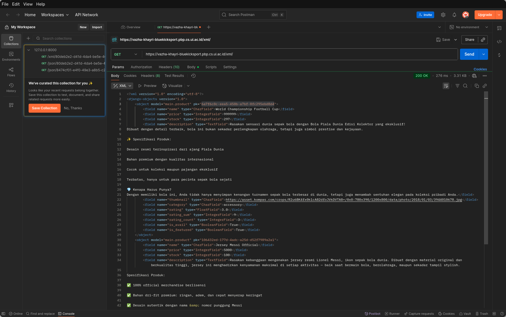
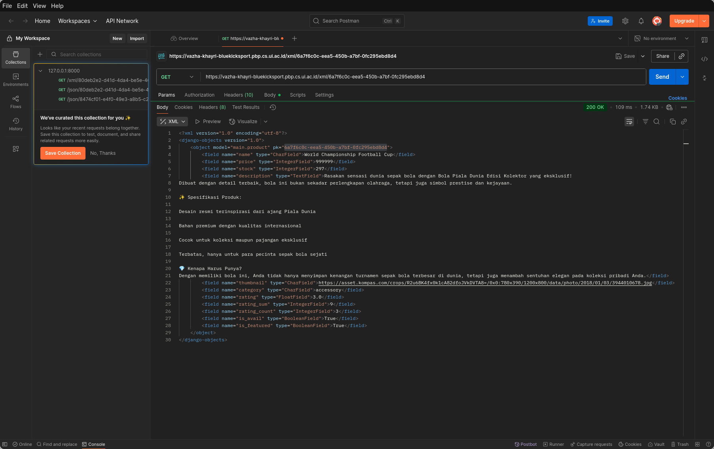
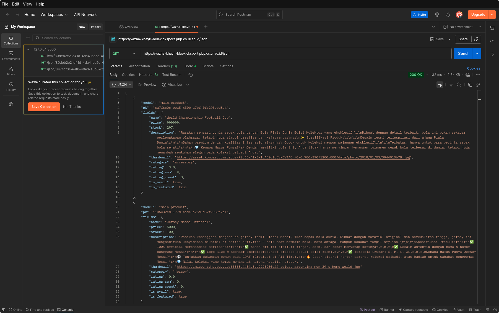
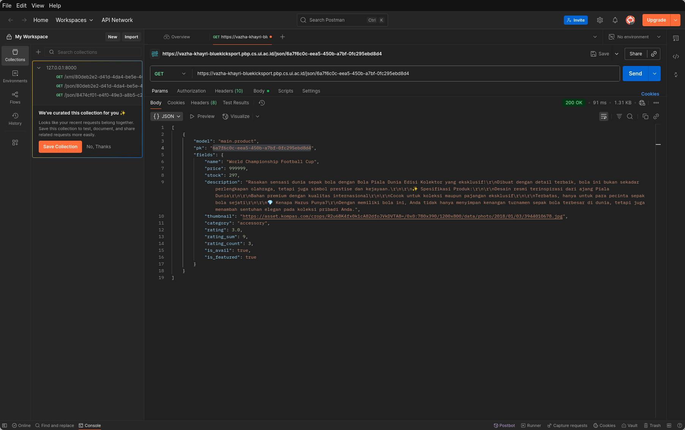
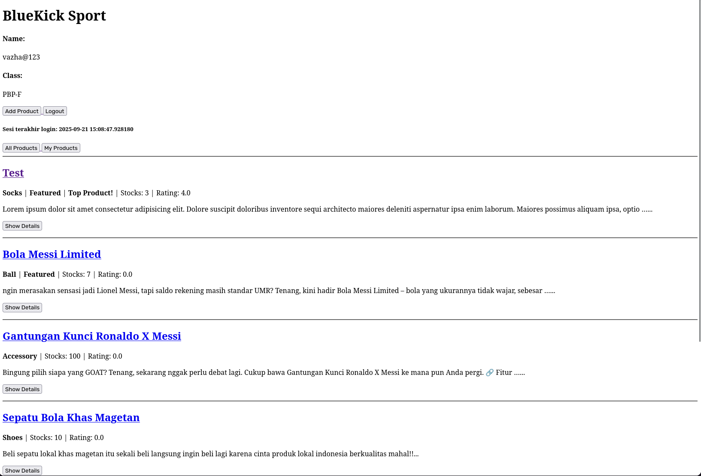
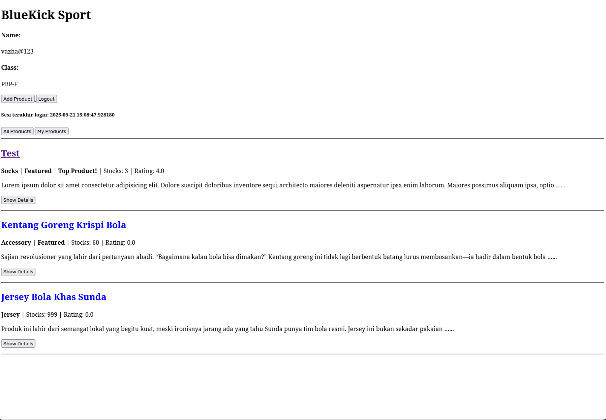

<h1>Tugas 2: Implementasi  Model-View-Template (MVT) pada Django</h1>

**Implementasi Aplikasi BlueKick Sport**

**A. Membuat Proyek Django Baru**

1. Membuat repository di Github
2. Melakukan clone repository ke local
3. Menginisiasi virtual environment python di repo dengan `python -m venv env` dan diaktifkan dengan `source env/bin/activate`
4. Membuat requirements.txt dan melakukan instalasi secara rekursif dengan `pip install -r requirements.txt` untuk dependencies berikut:

```
django
gunicorn
whitenoise
psycopg2-binary
requests
urllib3
python-dotenv
```

5. Inisiasli proyek django dengan `django-admin startproject football_shop .`
6. Membuat `.env` dan `.env.prod` dan melakukan konfirgurasi databse dan credentials.
7. Melakukan modifikasi pada `settings.py` untuk menambahkan environment variables, setting ALLOWED_HOSTS untuk mengizinkan host yang dapat deploy, menambahkan konfigurasi PRODUCTION, dan menyesuaikan konfigurasi DATABASES.
8. Setelahnya lakukan migrasi dengan `python manage.py migrate`

**B. Membuat aplikasi dengan nama `main` pada proyek**

1. membuat aplikasi dengan `python manage.py startapp main`
2. Menambahkan daftar aplikasi main pada INSTALLED_APPS di `settings.py`

**C. Melakukan Routing pada proyek agar dapat menjalankan aplikasi `main`**

1. Menginisiasikan main pada INSTALLED_APPS di `settings.py`
2. Buat `urls.py` pada aplikasi main
3. Menginisiasikan root ke halaman `views.py` untuk bisa menjalankan aplikasi

**D. Membuat model pada aplikasi `main` dengan nama `Product` dan memiliki atribute**

1. import models dari django ke dalam `models.py`
2. membuat class Product dengan parameter models.Model
3. Melakukan inisiasi variable yang sesuai dengan atribut wajib yang telah didefinisikan.

**E Membuat fungsi `views.py` dan dikembalikan dalam template HTML**

1. Membuat fungsi `def show_main(request)` pada views.py
2. Dalam `show_main`, berikan return berupa render dengan parameter request, `main.html`, db.
3. Buat folder templates yang berisi `index.html` dalam apps main, dan buat tampilan html di dalamnya.

**Membuat routing pada `urls.py` aplikasi main untuk memetakan fungsi yang telah dibuat pada `views.py`**

1. Inisiasi nama app dan pathnya pada `urls.py` di aplikasi main
2. import path dan include pada `urls.py` di folder project, lalu tambahkan route main di sana dengan `path([route], include('main.urls'))` untuk menampilkan aplikasi

**F. Melakukan deployment ke PWS**

1. Membuat project di PWS
2. Menyalin credentials berupa username dan password
3. Menginisiasikan environs sesuai dengan `.env.prods`
4. Menambahkan remote pws ke project dengan `git remote add pws https://pbp.cs.ui.ac.id/vazha.khayri/bluekicksport`
5. lalu push project ke pws dengan

```
git add .
git commit -m "Tugas 2"
git push pws master
```

6. Akan diminta username dan password, masukkan sesuai yang telah diberikan 6. Project di push dan secara otomatis terdeploy

**Bagan Request Client dari Django hingga Response**


**Peran `settings.py`**
`settings.py` merupakan tempat untuk melakukan konfigurasi project, dalam file tersebut kita dapat melakukan penyesuaian untuk project atau aplikasi yang kita buat, termasuk pengaturan environment, deployment, dan lain-lain.

**Kerja Migrasi Database Django**
Migrasi di django merupakan cara untuk membuat perubahan kepada model yang telah dibuat ke schema database.

Cara kerja migrasi

1. `makemigrations`, untuk membuat migrasi baru berdasarkan perubahan yang dibuat terhadap model
2. `migrate`, untuk memasang/melepas migrasi yg dibuat

Secara singkat migrasi bekerja dengan cara membuat tabel, ataupun kolom baru berdasarkan model yang dibuat atau attribute yang ditambah

**Kenapa Django untuk permulaan?**

- Django dipilih karena menggunakan bahasa python yang terkenal akan readability dan learning curve yang cocok untuk pemula

- Django memiliki dokumentasi yang lengkap dan komprehensif, menjelakan fungsi dengan jelas

- Filosofi "batteries-included" merupakan salah satu aspek utama kenapa Django cocok dijadikan framework untuk pemula, banyak tools yang disediakan secara built-in, seperti autentikasi dan admin panel yang bisa langsung dipakai.

**Feedback Dosen dan asdos tutorial 1**
Saya akan memberikan feedback yang sangat baik untuk kedua belah pihak

- Dosen, Kak Ilma membeirkan pengajaran yang baik, bukan hanya berpacu ke PPT saja, beliau seringkali menggambarkan konsep bagaimana framework Django bekerja denan detail dan memberikan penjelasan yang mudah dimengerti untuk orang yang belum pernah memakai django sebelumnya.

- Asdos sangat membantu, walaupun tutorial 1 dikerjakan secara online. Namun, saya pribadi mendapatkan kendala setelah mengerjakan tutorial 1, asdos secara cepat membalas keluhan saya walaupun waktu sudah malam dan memberikan langkah penyelesaian masalah yang sangat baik sehingga tutorial 1 saya kembali berfungsi.

---

<h1>TUGAS 3: Implementasi Form dan Data Delivery pada Django</h1>

**Jelaskan mengapa kita memerlukan data delivery dalam pengimplementasian sebuah platform?**

Data delivery diperlukan untuk pengguna yang mengakses client-based dapat melihat, mengakses, ataupun mengubah data yang ada di dalam server atau database. Tanpa mekanisme ini pengguna tidak dapat melihat informasi yang ada di dalam server

Data delivery memastikan pengguna dapat mengakses website secara interaktif dan sangat penting untuk fungsionalitas website itu sendiri, bayangkan ketika website seperti e-commerce tidak menggunakan data delivery. Maka maka pengguna mungkin dapat melihat produk karena tampilan produk langsung dibuat ke dalam template html, lalu setelahnya? Bagaimana pengguna dapat membeli produk tersebut?

**Menurutmu, mana yang lebih baik antara XML dan JSON? Mengapa JSON lebih populer dibandingkan XML?**

XML dan JSON memiliki keunggulan masing-masing, keduanya dapat digunakan untuk data formatting. Keunggulan dari masing-masing adalah:

1. JSON

- JSON merupakan data formatting yang ringan, lebih cepat dalam transmisi, dan menjadi _support native_ untuk web browsers.
- JSON cocok digunakan untuk RESTful API dan pembuatan aplikasi modern

2. XML

- Keunggulan XML cocok digunakan untuk mengolah data yang kompleks, memiliki data validasi yang ketat dari penamaan ataupun skemanya.
- XML cocok digunakan untuk pengolahan data atau dokumen yang besar seperti sistem aplikasi perusahaan.

Menurut opini saya pribadi, JSON lebih cocok digunakan karena bentuknya yang menyerupai dictionary lebih familiar, lebih cepat diproses, mudah untuk dibaca, dan juga sesuai untuk pengolahan aplikasi website dan mobile nantinya dalam pembelajaran PBP ini.

**Jelaskan fungsi dari method `is_valid()` pada form Django dan mengapa kita membutuhkan method tersebut?**

method tersebut digunakan untuk melakukan validasi ketika pengguna memasukkan data ke dalam form, method tersebut mengecek apakah data yang dimasukkan sudah sesuai dengan field dan format yang telah didefinisikan.

**Mengapa kita membutuhkan csrf_token saat membuat form di Django? Apa yang dapat terjadi jika kita tidak menambahkan csrf_token pada form Django? Bagaimana hal tersebut dapat dimanfaatkan oleh penyerang?**

csrf_token merupakan middleware yang disediakan oleh django untuk mencegah serangan Cross-Site Request Forgery. serangan ini memanfaatkan pengguna secara tidak sadar mengirimkan request berbahaya ke website yang menyebabkan hal yang tidak diinginkan seperti data yang bocor dan lainnya.

Cara kerja dari csrf_token ini adalah agar website membuat token yang unik dan dicocokkan saat user melakukan request ke server, agar ketika ada ketidakcocokkan (pihak ketiga) yang menyerang, maka request tersebut akan ditolak.

Ketika tidak adanya csrf_token ini, penyerang dapat menyisipkan request ke website dan tidak ada pencocokan token yang membuat request yang dikirim dapat dikira valid oleh website dan celah tersebut langsung dimanfaatkan oleh penyerang.

**Jelaskan bagaimana cara kamu mengimplementasikan checklist di atas secara step-by-step (bukan hanya sekadar mengikuti tutorial).**

1. Membuat fungsi `show_xml`, `show_json`, `show_xml_by_id`, dan `show_json_by_id` by ID pada views:

```python
def show_xml(request):
    product_list = Product.objects.all()
    xml_data = serializers.serialize('xml', product_list)
    return HttpResponse(xml_data, content_type='application/xml')


def show_json(request):
    product_list = Product.objects.all()
    json_data = serializers.serialize('json', product_list)
    return HttpResponse(json_data, content_type='application/json')


def show_xml_by_id(request, product_id):
    try:
        product_item = Product.objects.filter(pk=product_id)
        xml_data = serializers.serialize('xml', product_item)
        return HttpResponse(xml_data, content_type='application/xml')
    except Product.DoesNotExist:
        return HttpResponse(status=404)

def show_json_by_id(request, product_id):
    try:
        product_item = Product.objects.get(pk=product_id)
        json_data = serializers.serialize("json", [product_item])
        return HttpResponse(json_data, content_type="application/json")
    except Product.DoesNotExist:
        return HttpResponse(status=404)
```

2. Menambahkan masing-masing fungsi ke url pada `urls.py`:

```python
...
path('xml/', show_xml, name='show_xml'),
path('json/', show_json, name='show_json'),
path('xml/<str:product_id>/', show_xml_by_id, name='show_xml_by_id'),
path('json/<str:product_id>/', show_json_by_id, name='show_json_by_id'),
...
```

3. Membuat file `forms.py` untuk membuat model dan fungsionalitas penambahan produk:

```python
from django.forms import *
from main.models import Product

class ProductForm(ModelForm):
    class Meta:
        model = Product
        fields = ['name', 'price', 'stock', 'description', 'thumbnail', 'category', 'is_featured']
```

4. Membuat `base.html` sebagai struktur utama dari html dalam aplikasi, dan mendefinisikan sebagai BASE_DIR pada `settings.py`:

```html

<!DOCTYPE html>
<html lang="en">
  <head>
    <meta charset="UTF-8" />
    <meta name="viewport" content="width=device-width, initial-scale=1.0" />
    
  </head>
  <body>
    
  </body>
</html>
```

4. Membuat html berupa `add_product.html` sebagai tempat untuk menambahkan produk dan `product_detail.html` untuk melihat detail produk. Keduanya juga di extends dari struktur html yang telah dibuat pada `base.html`

5. Menambahkan tampilan baru pada `main.html` untuk:

- Menambahkan produk, dengan fungsi:

```python
def add_product(request):
    form = ProductForm(request.POST or None)

    if form.is_valid() and request.method == 'POST':
        form.save()
        return redirect('main:show_main')

    context = {'form': form}
    return render(request, 'add_product.html', context)
```

- Melihat list produk, dengan memperbarui `show_main`:

```python
def show_main(request):
    product_list = Product.objects.all()

    context = {
        'app_name': 'BlueKick Sport',
        'name': 'Vazha Khayri',
        'class': 'PBP-F',
        'product_list': product_list
    }

    return render(request, 'main.html', context)
```

- Button atau judul produk yang dapat melihat produk secara lebih detail, dengan fungsi:

```python
def show_product(request, id):
    product = get_object_or_404(Product, pk=id)
    context = {
        'product': product
    }

    if request.method == "POST":
        rate = int(request.POST.get('rate', 0))
        product.give_rating(rate)
        product.stock -= 1
        product.save()
        return redirect('main:show_main')

    return render(request, 'product_detail.html', context)
```

Fungsi yang ditambahkan juga dimasukkan routenya ke dalam `urls.py`

```python
path('add_product/', add_product, name='add_product'),
path('product/<str:id>/', show_product, name='show_product'),
```

6. Terakhir, mendefinisikan domain untuk csrf pada `settings.py`:

```python
CSRF_TRUSTED_ORIGINS = [
    'https://vazha-khayri-bluekicksport.pbp.cs.ui.ac.id'
]
```

**Feedback untuk asdos di tutorial 2**
Asdos sangat membantu terutama menghadapi beberapa error yang terjadi pada pendefinisian schema dan juga database, forum FAQ dijawab dengan on point, dan asdos saya secara pribadi juga membantu untuk menyelesaikan masalah yang dialami.

**Screenshot Postman**

- XML
  

- XML by id
  

- JSON
  

- JSON by id
  

---

<h1>TUGAS 3: Implementasi Form dan Data Delivery pada Django</h1>

**Apa itu Django `AuthenticationForm`? Jelaskan juga kelebihan dan kekurangannya.**

Merupakan Form bawaan untuk user melakukan login pengguna:
**Kelebihan:**

- Tidak perlu membuat authentication logic from scratch, sudah tersedia dan siap pakai

- Session dan Middleware sudah terintegrasi langsung dengan sistem Auth Django

- Lebih aman karena secara default sudah menerapkan hashing password, session dan middleware

- Lebih mudah karena tidak perlu membuat seperti JWT Token dan lainnya secara manual

**Kekurangan**

- Keterbatasan pilihan login hanya username dan password, jika ingin menggunakan Sign in options seperti Google, Email, hingga SSO tidak bisa.

- Secara default tidak disediakan 2FA, jadi untuk lebih aman harus setting manual

- Tidak memiliki limitasi untuk percobaan login, bisa di DDoS atau di Brute Force

- Jika ingin menggunakan selain Django Template Engine, tidak disarankan menggunakan AuthenticationForm karena kurang relevan karena backend hanya sebagai endpoint untuk auth-nya.

**Apa saja kelebihan dan kekurangan session dan cookies dalam konteks menyimpan state di aplikasi web?**

**1. Cookies**
Informasi kunjungan web yang dikirimkan ke browser dan disimpan ke _device_ seperti login details, preferensi, shopping carts, ataupun lainnya.

**Kelebihan**

- Dapat diakses langsung dari browser
- client side, jadi tidak perlu menyimpan data ke server
- Preferensi untuk kenyamanan user dalam menggunakan website

**Kekurangan**

- Cookie memiliki ukuran yang kecil dan terbatas, biasanya 4KB
- Tidak cocok untuk menyimpan data-data sensitif
- User dapat mengelola cookie yang dimiliki

**2. Session**
Informasi yang disimpan langsung ke server dalam suatu aplikasi yang didapatkan saat user berinteraksi dengan aplikasi. Informasi yang disimpan meliputi authentication, preferensi, dan data-data yang diinput oleh user.

**Kelebihan**

- Lebih aman, karena data sensitif langsung disimpan ke server
- Penyimpanan data bisa lebih besar
- Data yang didapatkan bisa diolah untuk fitur" lainnya yang bisa digunakan user

**Kekurangan**

- Server membutuhkan penyimpanan yang besar
- Dari sisi developer, diperlukan maintain berkala dan terdapat cost yang dikeluarkan untuk tetap menjalankan server.
- Session memiliki expired time, dan user biasanya harus login ulang jika session tersebut sudah expired

**Apakah penggunaan cookies aman secara default dalam pengembangan web, atau apakah ada risiko potensial yang harus diwaspadai? Bagaimana Django menangani hal tersebut?**

Terdapat beberapa risiko yang harus di antisipasi saat menyimpan data menggunakan cookies karena secara default tidak aman. Beberapa risiko yang harus diwaspadai:

- Penyerang dapat membaca cookies dan melakukan hijacking user
- Penyerang dapat melakukan request yang berbahaya ke server
- Data yang disimpan dalam cookie bisa dicuri
- Dan lainnya

Django telah melakukan antisipasi hal ini dengan mengirim cookies hanya pada HTTPS, memiliki built in CSRF protection untuk mencegah penyerang melakukan request ke server, session tidak disimpan secara langsung di cookies, terdapat SESSION_COOKIE_SECURE, SESSION_COOKIE_HTTPONLY, dan SESSION_COOKIE_SAMESITE untuk membatasi risiko penyerangan siber yang bisa saja terjadi.

**Jelaskan bagaimana cara kamu mengimplementasikan checklist di atas secara step-by-step (bukan hanya sekadar mengikuti tutorial).**

1. Pada `views.py` melakukan import authentications library dari python dan membuat fungsi auth-nya.

```python
...
from django.contrib.auth.forms import *
from django.contrib import messages
from django.contrib.auth import *
from django.contrib.auth.decorators import *
...
```

```python

def register(request):
    form = UserCreationForm()

    if request.method == "POST":
        form = UserCreationForm(data=request.POST)

        if form.is_valid():
            form.save()
            messages.success(request, 'Your account has been successfully created!')
            return redirect('main:login')
    context = {'form':form}
    return render(request, 'register.html', context)

def login_user(request):
    if request.method == "POST":
        form = AuthenticationForm(data=request.POST)

        if form.is_valid():
            user = form.get_user()
            login(request, user)
            response = HttpResponseRedirect(reverse("main:show_main"))
            response.set_cookie('last_login', str(datetime.datetime.now()))
            return response

    else:
        form = AuthenticationForm(request)
    context = {'form':form}
    return render(request, 'login.html', context)

def logout_user(request):
    logout(request)
    response = HttpResponseRedirect(reverse('main:login'))
    response.delete_cookie('last_login')
    return response

```

2. Implementasi login di aplikasikan pada template html, dan membuat form untuk login dan registrasi
   a. `register.html`

   ```html
    
   <title>Register</title>
    

   <div>
     <h1>Register</h1>

     <form method="POST">
       
       <table>
         {{ form.as_table }}
         <tr>
           <td></td>
           <td><input type="submit" name="submit" value="Daftar" /></td>
         </tr>
       </table>
     </form>

     
     <ul>
       
       <li>{{ message }}</li>
       
     </ul>
     
   </div>

   
   ```

   b. `login.html`

   ```html
    
   <title>Login</title>
    
   <div class="login">
     <h1>Login</h1>

     <form method="POST" action="">
       
       <table>
         {{ form.as_table }}
         <tr>
           <td></td>
           <td><input class="btn login_btn" type="submit" value="Login" /></td>
         </tr>
       </table>
     </form>

     
     <ul>
       
       <li>{{ message }}</li>
       
     </ul>
      Don't have an account yet?
     <a href="">Register Now</a>
   </div>

   
   ```

   c. Modifikasi `main.html`

   ```html
    
   <h1>{{app_name}}</h1>

   <!-- Ubah sesuai dengan nama kamu -->
   <h4>Name:</h4>
   <p>{{name}}</p>
   <!-- Ubah sesuai dengan kelas kamu -->
   <h4>Class:</h4>
   <p>{{class}}</p>

   <a href="">
     <button>Add Product</button>
   </a>

   <a href="">
     <button>Logout</button>
   </a>
   <h5>Sesi terakhir login: {{ last_login }}</h5>

   <a href="?filter=all">
     <button type="button">All Products</button>
   </a>
   <a href="?filter=my">
     <button type="button">My Products</button>
   </a>

   <hr />

   
   <p>Belum ada product pada {{app_name}}</p>
    
   <div>
     <h2>
       <a href="">{{ product.name }}</a>
     </h2>

     <p>
       <b>{{ product.get_category_display }}</b>  |
       <b>Featured</b> 
       <span>
          | <b>Top Product!</b>  |
         Stocks: {{ product.stock }} | Rating: {{ product.rating }}
       </span>
     </p>

     
     
     

     <p>{{ product.description|truncatewords:25 }}...</p>
     <p>
       <a href=""
         ><button>Show Details</button></a
       >
     </p>
   </div>
   <hr />
     
   ```

3. Setelah membuat authentication pada views dan template, langkah selanjutnya yang dilakukan adalah membuat entity user pada models yang bisa disimpan dalam database setelah user melakukan register dan login.

```python
user = models.ForeignKey(User, on_delete=models.CASCADE, null=True)
```

Lakukan migrasi kembali untuk mendaftarkan entity user ke dalam database.

4. Lalu setelahnya, kita batasi halaman utama untuk melihat produk dan untuk menambahkan produk dengan property

```python
@login_required(login_url='/login')
```

Agar user diminta untuk melakukan login sebelum bisa mengakses aplikasi

5. Menambahkan fitur filter produk pada fungsi show_main agar user dapat melihat produk yang dimiliki dan produk keseluruhan:

```python
@login_required(login_url='/login')
def show_main(request):
    filter_type = request.GET.get("filter", "all")

    if filter_type == "all":
        product_list = Product.objects.all()
    else:
        product_list = Product.objects.filter(user=request.user)

    context = {
        'app_name': 'BlueKick Sport',
        'name': request.user.username,
        'class': 'PBP-F',
        'product_list': product_list,
        'last_login': request.COOKIES.get('last_login', 'Never')
    }

    return render(request, 'main.html', context)

```

6. Menambahkan path pada `urls.py` untuk fitur-fitur yang telah ditambahkan.

```python
...
path('register/', register, name='register'),
path('login/', login_user, name='login'),
path('logout/', logout_user, name='logout'),
...
```

7. Berikut adalah contoh tampilan aplikasi yang diakses user setelah login.

- All Products
  

- My Products
  
